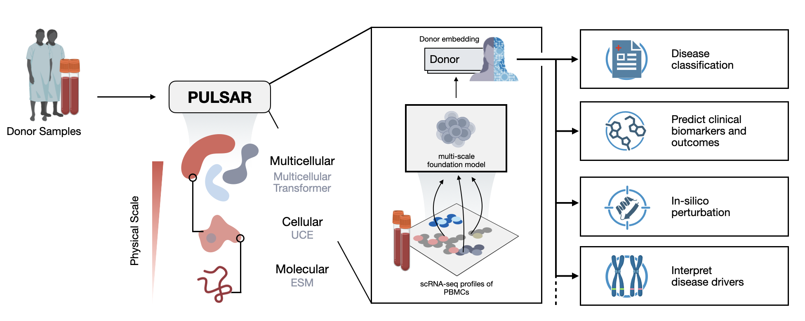

# PULSAR: Towards a Donor Foundation Model with Multicellular AI Virtual Cell

PULSAR (Patient Understanding Leveraging Single-cell universAl Representation) is a multi-scale, multi-cellular foundation model for human peripheral immunity that bridges single-cell atlases with clinical phenotypes. PULSAR hierarchically integrates information from genes to cells to multicellular systems, trained via self-supervision on 36.2 million cells from 6,807 donors.

<!-- insert image PULSAR-release-dev/assets/cover.png -->


| [Preprint](placeholder) |


## Installation
- We use `uv` to manage virtual environments and dependencies. Refer to the [uv documentation](https://docs.astral.sh/uv/) to install uv.
- Then use `uv` to create a virtual environment and install dependencies:
```bash
uv sync # create venv
uv pip install -e . # installs the package in editable mode
```

## Usage
Refer to Examples section below for example notebooks demonstrating how to use PULSAR for various downstream tasks.
In brief, you can load a pre-trained PULSAR model as follows:
```python
from pulsar.model import PULSAR
model = PULSAR.from_pretrained("KuanP/PULSAR-pbmc")
```

We also provide utilities to extract donor embeddings from single-cell data in H5AD format, as follows:
```python
from pulsar.utils import extract_donor_embeddings_from_h5ad
donor_embeddings = extract_donor_embeddings_from_h5ad(
    h5ad_path="path_to_your_h5ad_file.h5ad",
    model=model,
    donor_id_key="donor_id_column_in_obs",
)
```
This function will return a dictionary mapping donor IDs to their corresponding PULSAR embeddings. Column name in `.obs` containing donor IDs can be specified via `donor_id_key`.

Note that this function requires you to obtain cell-level embeddings for H5AD first in `.obsm`, a pipeline line for extracting UCE embedding can be found [here](https://github.com/snap-stanford/UCE). 


## Examples

| Notebook | Description |
|---------|----------|
| [Zero-shot age regression](./examples/example_age_regression.ipynb) | Demonstrates age regression using zero-shot PULSAR embeddings with subsampled [OneK1K](https://www.science.org/doi/10.1126/science.abf3041) dataset. |
| [Zero-shot disease classification](./examples/example_lupus_classification.ipynb) | Demonstrates lupus disease classification using zero-shot PULSAR embeddings (using subsampled [Lupus dataset](https://www.science.org/doi/10.1126/science.abf1970)). |
| [Searching donor embeddings](./examples/example_DONORxEMBED_search.ipynb) | Demonstrates searching donors using PULSAR embeddings against `DONORxEMBED`. |

Data used for the examples can be downloaded from [here](https://drive.google.com/drive/folders/1gD1V2d3Ual2QCA0h-XiGXtmGE-w1S5D7?usp=drive_link).

## Model weights 

| Model | Description | Parameters | Context Length | Download |
|-------|-------------|------------|----------------|----------|
| `PULSAR-pbmc` | Continually pre-trained on 8.8M PBMC data from 2,588 donors, best for PBMC-related tasks | 87.4M | 1024 | [🤗 HuggingFace](https://huggingface.co/KuanP/PULSAR-pbmc) |
| `PULSAR-aligned` | Aligned version of PULSAR-pbmc using disease labels | 87.4M | 1024 | [🤗 HuggingFace](https://huggingface.co/KuanP/PULSAR-aligned) |

Model weights are directly loadable via the `transformers` library, for example:

```python
from pulsar.model import PULSAR
model = PULSAR.from_pretrained("KuanP/PULSAR-pbmc")
```

## DONORxEMBED Datasets


We release the DONORxEMBED datasets for both zero-shot and aligned PULSAR, you can find example for loading the datasets [here](./examples/example_DONORxEMBED_search.ipynb).

| Dataset | Download |
|---------|----------|
| PULSAR_DONORxEMBED_zero_shot | [🤗 HuggingFace](https://huggingface.co/datasets/KuanP/PULSAR_DONORxEMBED_zero_shot) |
| PULSAR_DONORxEMBED_aligned | [🤗 HuggingFace](https://huggingface.co/datasets/KuanP/PULSAR_DONORxEMBED_aligned) |


## Acknowledgements

We sincerely thank the authors of following open-source projects:

- [uv](https://github.com/Astral-Dev/uv)
- [scanpy](https://github.com/scverse/scanpy)
- [transformers](https://github.com/huggingface/transformers)
- [datasets](https://github.com/huggingface/datasets)
- [UCE](https://github.com/snap-stanford/UCE)


## Cite Us
```
placeholder
```
